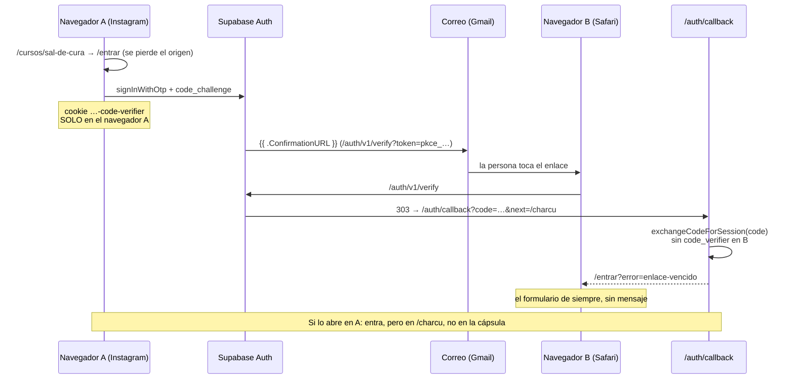

# Fuga del enlace mágico: quien lo pide y no termina de entrar

> Investigación del 2026-10-07, rama `investigacion/enlace-magico-fuga`.
> Probado en QA. **No se tocó producción ni la configuración de Supabase.**
> Nada de la experiencia de entrada cambió: solo se agregó medición.

## Resumen

Las dos hipótesis se confirman, y aparecieron dos fallos más:

1. **Si el enlace se abre en otro navegador, no entra.** La app usa PKCE y el
   `code_verifier` vive en una cookie del navegador que pidió el enlace. Es justo
   lo que pasa al pedirlo en Instagram y abrirlo desde Gmail en Safari.
2. **Aunque entre, no vuelve a donde iba.** Todo enlace lleva a `/charcu`, y
   quien llega sin sesión a una cápsula pierde la dirección en el primer salto.
3. **El error no se le muestra a nadie.** El callback manda a
   `/entrar?error=enlace-vencido`, pero `/entrar` no lee `error`: vuelve a pedir
   el correo como si nada hubiera pasado.
4. **No había forma de medirlo.** Los eventos que existían no decían desde qué
   navegador ni si fue el mismo, y el primer evento de `/entrar` se perdía (ver
   «Eventos»).

## Cómo funciona hoy

- Se pide en dos sitios, los dos con `signInWithOtp` y
  `emailRedirectTo = /auth/callback?next=/charcu`, sin `shouldCreateUser` (el
  correo nuevo crea cuenta):
  - `features/auth-by-email/model/useEmailAuth.ts` → la página `/entrar`;
  - `features/lead-capture/lib/sendAccountLink.ts` → el muro de la tercera pregunta.
- El cliente es `createBrowserClient` de `@supabase/ssr` 0.12.4, que fija
  `flowType: "pkce"`.
- Las plantillas **Magic Link** y **Confirm signup** de QA arman el enlace con
  `{{ .ConfirmationURL }}` (confirmado por la API de administración, solo
  lectura). Las de `supabase/templates/` del repo dicen lo mismo. **Las de
  producción no las revisé**, ni siquiera en lectura: está pendiente.
- `/auth/callback` acepta `?code=` (`exchangeCodeForSession`) y
  `?token_hash=&type=` (`verifyOtp`). Hoy solo llega el primero.
- La app entera (`src/app/(app)/layout.tsx`) manda a `/entrar` a quien no tiene
  sesión. Las cápsulas y el curso gratis no abren una hoja: expulsan.

## Reproducción

`e2e/enlace-magico.spec.ts` lo hace solo: pide el enlace con el user agent de
Instagram, lee el token de `auth.one_time_tokens` y abre la URL exacta del
correo. Es un flujo de verdad, sin atajos de administración.

**Hipótesis 1 (otro navegador): confirmada.**

- `exchangeCodeForSession` falla con `AuthPKCECodeVerifierMissingError`, código
  `pkce_code_verifier_not_found`. El propio mensaje de la librería dice «This
  can happen if the auth flow was initiated in a different browser or device».
- Al usuario **no se le muestra nada**: aterriza en `/entrar?error=enlace-vencido`
  con el formulario de siempre («Guarda tus recetas… Enviarme el enlace»).
- **Además, el enlace queda gastado.** Si después lo abre en el navegador
  correcto, Supabase lo rechaza con `otp_expired` y tampoco entra (comprobado en
  el e2e). La persona tiene que pedir otro enlace sin que nadie le haya dicho
  por qué.
- Con el mismo enlace en el navegador A, entra sin problema. La única diferencia
  es la cookie del verificador.

**Hipótesis 2 (no vuelve a donde iba): confirmada, y es más amplia de lo que se
suponía.**

- Quien llega sin sesión a `/cursos/sal-de-cura` cae en `/entrar` y la ruta se
  pierde ahí mismo.
- El enlace lleva siempre a `/charcu`, aunque se abra en el mismo navegador.
- Si la cuenta es nueva, encima le sale el onboarding antes de la app.

## Qué se agregó para medir

Siete eventos, sin datos personales: ids aleatorios, el `visitor_id` anónimo y
rutas de la web. Ningún evento lleva correo.

| Evento                           | Dónde                   | Cuándo                                                                                                                           |
| -------------------------------- | ----------------------- | -------------------------------------------------------------------------------------------------------------------------------- |
| `auth_modal_opened`              | navegador               | Se le pide la cuenta: muro de la 3.ª pregunta, o `/entrar`.                                                                      |
| `magic_link_requested`           | navegador               | Supabase aceptó el correo.                                                                                                       |
| `magic_link_landed`              | **servidor** (callback) | Abrió el enlace y llegó al callback.                                                                                             |
| `auth_completed` / `auth_failed` | **servidor**            | Abrió sesión / no. `auth_failed` lleva `reason`.                                                                                 |
| `returned_to_origin`             | navegador               | Tras entrar, llegó a la página que había elegido (máx. 30 min después). Lleva `pasos`.                                           |
| `auth_link_error`                | navegador (`/entrar`)   | Supabase rechazó el enlace antes del callback. Lleva el `reason` real (ver abajo). No es un paso del embudo.                     |
| `auth_modal_closed`              | navegador (la hoja)     | Cerró la hoja sin entrar (2026-10-08). `paso` (`correo` / `revisa_correo`), `escribio_correo`, `hubo_error`, `segundos_abierta`. |

Todos llevan:

- `in_app_browser`: `instagram`, `facebook`, `tiktok`, `whatsapp`, `otro` o
  `ninguno`, leído del user agent.
- `device` y `os`.
- `trigger`: `capsula`, `curso_gratis`, `curso`, `tercera_pregunta`,
  `menu_entrar` o `app`.
- `origen` (la ruta elegida) e `intento` (un id aleatorio).

**Cómo se une a la persona entre dos navegadores.** Al pedírsele la cuenta se
crea un `intento` que vive en una cookie y viaja también como parámetro del
`emailRedirectTo`, junto con el `visitor_id` de quien lo pide. En el callback:

- `same_browser` sale de comparar el intento de la cookie con el del enlace;
- los eventos del servidor se mandan a nombre del `visitor_id` de quien PIDIÓ.

Así, una persona que pide en Instagram y abre en Safari es una sola persona en
Mixpanel. `next` no cambia: los parámetros se suman.

Valores de `reason` en `auth_failed`, que mide el servidor:

- `pkce_code_verifier_not_found`: otro navegador.
- `flow_state_not_found` o `flow_state_expired`: el enlace es de un intento
  viejo.
- `sin_codigo`: llegó sin `code` ni `token_hash`. Casi siempre significa que
  Supabase ya había rechazado el enlace antes.

El motivo de ese rechazo **no lo ve el servidor**: Supabase lo deja en el
fragmento de la URL (`#error_code=otp_expired`). Por eso `/entrar` lo lee y
manda `auth_link_error`:

- `otp_expired`: enlace vencido o **ya usado**. Sale cuando se abre por segunda
  vez después de un intento fallido. Ojo también con Outlook y Hotmail: sus
  filtros abren los enlaces para revisarlos y pueden gastar el token antes que
  la persona. Esto encaja con la sospecha de Hotmail que ya existía.

Lo que estos eventos destaparon y ya quedó arreglado:

- `track()` descartaba en silencio lo que llegaba antes de que `AppProviders`
  iniciara Mixpanel. Como React corre los efectos de los hijos antes que los
  del padre, `auth_modal_opened` en `/entrar` se perdía. Ahora esos eventos
  esperan en una cola.
- La propiedad `same_browser` en los eventos del navegador siempre vale `true`,
  porque se está donde se pide. La que importa es la de los eventos del servidor.

### El embudo en Mixpanel (proyecto de producción 4047533)

**Embudo 1: conversión por navegador.**

- Pasos: `auth_modal_opened` → `magic_link_requested` → `magic_link_landed` →
  `auth_completed` → `returned_to_origin`.
- **Hold property constant: `intento`.** Así cada fila es un intento, no una
  persona que lo intentó tres veces.
- Ventana de conversión: **2 horas**. El enlace vence a la hora y el regreso se
  mide hasta 30 minutos después.
- Desglose por `in_app_browser` y `trigger`, **atribuido al paso 1**: lo que
  importa es dónde se pidió, no dónde se abrió.

**Embudo 2: el salto entre navegadores.**

- Pasos: `magic_link_landed` → `auth_completed`.
- Desglose por `same_browser` (y por `in_app_browser` del paso 1 del embudo 1).
- Esta es la cifra que prueba o descarta la hipótesis 1.

**Insights:** `auth_failed` desglosado por `reason` e `in_app_browser`, y
`auth_link_error` desglosado por `reason`.

**Cómo leerlo:**

- **Caída entre `requested` y `landed`:** el correo no llegó o no se abrió (spam,
  Hotmail). No tiene que ver con el navegador.
- **Caída entre `landed` y `completed` con `same_browser = false`:** es la
  hipótesis 1, en cifras.
- **`completed` sin `returned_to_origin`:** es la hipótesis 2. Hoy debería salir
  casi en cero para `capsula` y `curso_gratis`.

Antes de leer cifras hacen falta **una o dos semanas de producción** con esta
medición desplegada. Hoy solo está en esta rama.

## Opciones de solución

Ordenadas por impacto entre esfuerzo. **Ninguna está implementada.**

| #   | Opción                                            | Impacto    | Esfuerzo   | Notas                                                                                                                                                                                                                                                                                                                                                                                                                                                  |
| --- | ------------------------------------------------- | ---------- | ---------- | ------------------------------------------------------------------------------------------------------------------------------------------------------------------------------------------------------------------------------------------------------------------------------------------------------------------------------------------------------------------------------------------------------------------------------------------------------ |
| 1   | **Volver al origen** (`next` = la página elegida) | Alto       | Bajo       | Arregla la hipótesis 2. El layout ya pasa `desde` a `/entrar`; falta usarlo como `next`, y que el onboarding devuelva ahí al terminar.                                                                                                                                                                                                                                                                                                                 |
| 2   | **a) `token_hash` + `verifyOtp` en el servidor**  | Alto       | Bajo       | El callback ya lo soporta: es **solo cambiar las plantillas** de QA y producción, por ejemplo `{{ .RedirectTo }}&token_hash={{ .TokenHash }}&type=email`. Funciona en cualquier navegador. Pero la sesión se abre en Safari, no en Instagram: la persona sigue allá. ⚠️ Riesgo: los filtros de correo que abren el enlace lo gastarían, y abrirían sesión. Mitigación: que el callback pida un clic en «Entrar» (POST) en vez de verificar con el GET. |
| 3   | **Mostrar el error en `/entrar`**                 | Medio      | Bajo       | Leer `?error=` y explicarlo: «Abriste el enlace en otro navegador. Pídelo de nuevo desde aquí», o con la opción b, «escribe el código». Hoy no se dice nada.                                                                                                                                                                                                                                                                                           |
| 4   | **b) Código en el mismo correo**                  | Alto       | Medio      | `{{ .Token }}` en la plantilla y una casilla en la pantalla original (`verifyOtp({ email, token, type: 'email' })`). Es la única opción que **abre sesión en el navegador interno donde estaba la persona**, sin salir de Instagram. Hoy el código es de **8 dígitos** (`mailer_otp_length = 8`); bajarlo a 6 es un cambio de configuración. Convive con la opción a en el mismo correo.                                                               |
| 5   | **c) Sugerir «Abrir en el navegador»**            | Medio-bajo | Bajo-medio | En Android se puede abrir Chrome con `intent://`. En iOS no hay forma fiable de sacar a alguien del navegador de Instagram: queda en una instrucción («toca ··· → Abrir en el navegador»), que es fricción en sí misma. Mejor como complemento de la opción b que como solución.                                                                                                                                                                       |
| 6   | **d) La pestaña original continúa sola**          | Bajo       | Medio      | Solo ayuda cuando es el **mismo** navegador y el enlace abrió otra pestaña. En el caso de Instagram el enlace nunca vuelve a ese navegador, así que no toca el problema principal.                                                                                                                                                                                                                                                                     |

**Recomendación:** hacer la 1 y la 3 enseguida, porque son de esfuerzo bajo y
no dependen de los datos. Medir una o dos semanas. Si la caída entre
navegadores es grande, hacer la 4 (código) junto con la 2 (enlace con
`token_hash`), protegida con un clic.

## Pendientes y riesgos

- **Producción sin revisar:** las plantillas y la `uri_allow_list`. No las leí
  sin tu aprobación. Agregar parámetros a `emailRedirectTo` no cambia el
  dominio, y Supabase acepta redirecciones al mismo dominio del `site_url`. Aun
  así hay que confirmarlo antes de desplegar.
- **El e2e manda correos de verdad.** Cada corrida manda dos por Resend a
  direcciones `.test`, que rebotan y pueden pesar en la reputación del dominio
  que manda. Por eso en CI se salta.
- **El perfil de Mixpanel tiene el correo.** `identifyAccount` guarda `$email`
  desde antes de este cambio. Los eventos nuevos no lo llevan.
- **Detección de Facebook.** Messenger y Facebook comparten marca (`FBAN`) y
  salen los dos como `facebook`.
